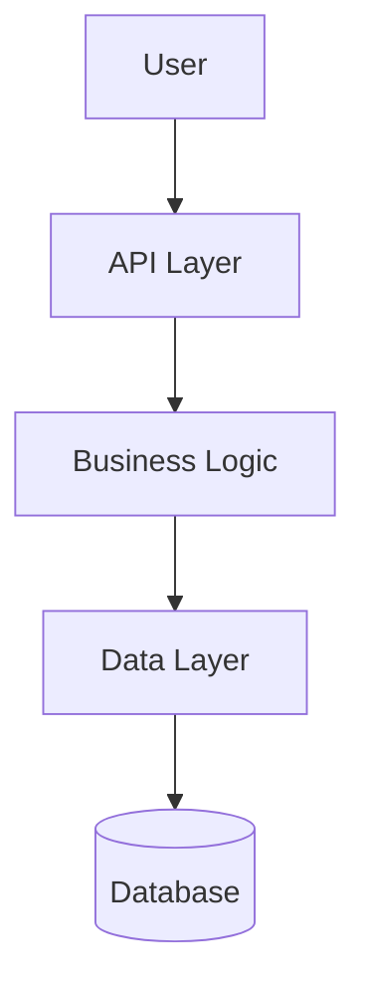
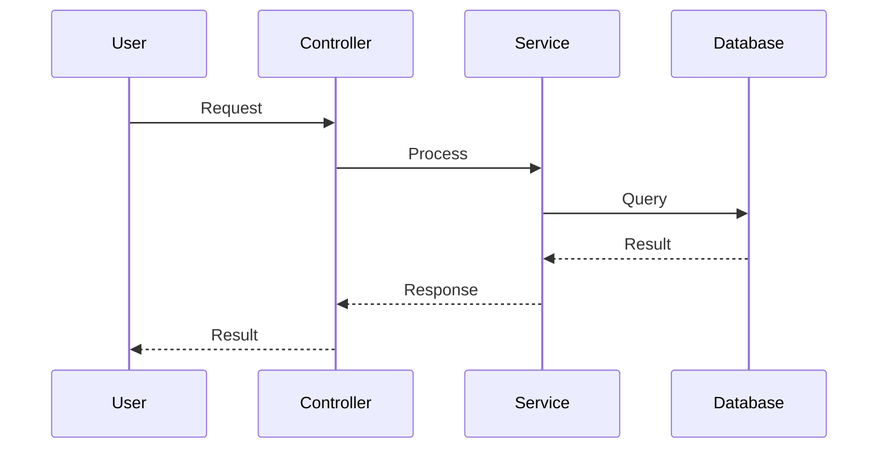
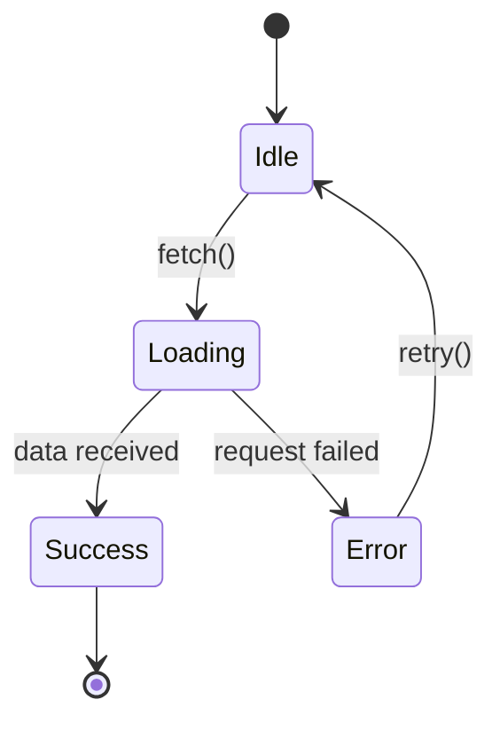

# Documentation Manager

Maintain structured, concise, and up-to-date documentation in the `docs/` folder. Keep documentation focused, prevent duplication, and create helpful visualizations.

## Context

Use this skill when:
- Code changes are made that affect existing functionality
- New features or components are added
- Architecture or design patterns change
- Documentation becomes outdated or duplicated
- Starting a new project that needs documentation structure

## Process

### 1. Analyze Current State

- Read all files in `docs/` to understand existing structure
- Identify what components/features have been changed in the codebase
- Check for outdated information, duplication, or structural issues
- Note gaps in documentation coverage

### 2. Plan Documentation Updates

Create a todo list with specific documentation tasks:
- Files that need updating
- New documentation files needed
- Duplicate content to merge
- Visualizations to create or update

### 3. Maintain Structure

Follow this documentation structure in `docs/`:

```
docs/
├── getting-started.md          # Quick start guide
├── architecture/
│   ├── overview.md             # System architecture overview
│   ├── components.md           # Component descriptions
│   └── diagrams/               # Mermaid diagrams and visuals
├── guides/
│   ├── [feature-name].md       # Feature-specific guides
│   └── [workflow-name].md      # Workflow guides
└── reference/
    ├── api.md                  # API reference
    └── configuration.md        # Configuration options
```

### 4. Content Guidelines

**Keep it concise**:
- Use bullet points and short paragraphs
- Focus on "what" and "why", not just "how"
- Link to code with `file_path:line_number` references
- Maximum 200 lines per document (split if longer)

**Prevent duplication**:
- Cross-reference related docs instead of repeating
- Use a single source of truth for each concept
- Link rather than duplicate

**Make it actionable**:
- Start with concrete examples
- Include quick-start code snippets
- Provide clear next steps

**Add visualizations**:
- Use Mermaid diagrams for:
  - Architecture diagrams (graph TD)
  - Sequence flows (sequenceDiagram)
  - State machines (stateDiagram-v2)
  - Class relationships (classDiagram)
- Keep diagrams simple and focused
- Add brief explanations below diagrams

### 5. Update Documentation

For each documentation task:
- Update or create the file
- Ensure consistent formatting
- Add diagrams where helpful
- Verify all code references are accurate
- Check for broken links

### 6. Verify Quality

- All docs follow the structure
- No duplication exists
- Content is concise and relevant
- Diagrams render correctly
- Code references are valid

## Guidelines

**DO**:
- Keep language simple and direct
- Use active voice
- Include practical examples
- Create visual aids for complex concepts
- Reference actual code locations
- Update docs immediately after code changes

**DON'T**:
- Create verbose or academic documentation
- Duplicate information across files
- Include outdated code examples
- Write documentation for documentation's sake
- Put README.md in docs/ (keep it in root)
- Create documentation for trivial features

## Visualization Examples

### Architecture Overview


### Component Interaction


### State Management


## Output

After completion:
- Updated or new documentation files in `docs/`
- Clear structure with no duplication
- Helpful diagrams and visualizations
- Concise, actionable content
- Summary of changes made
