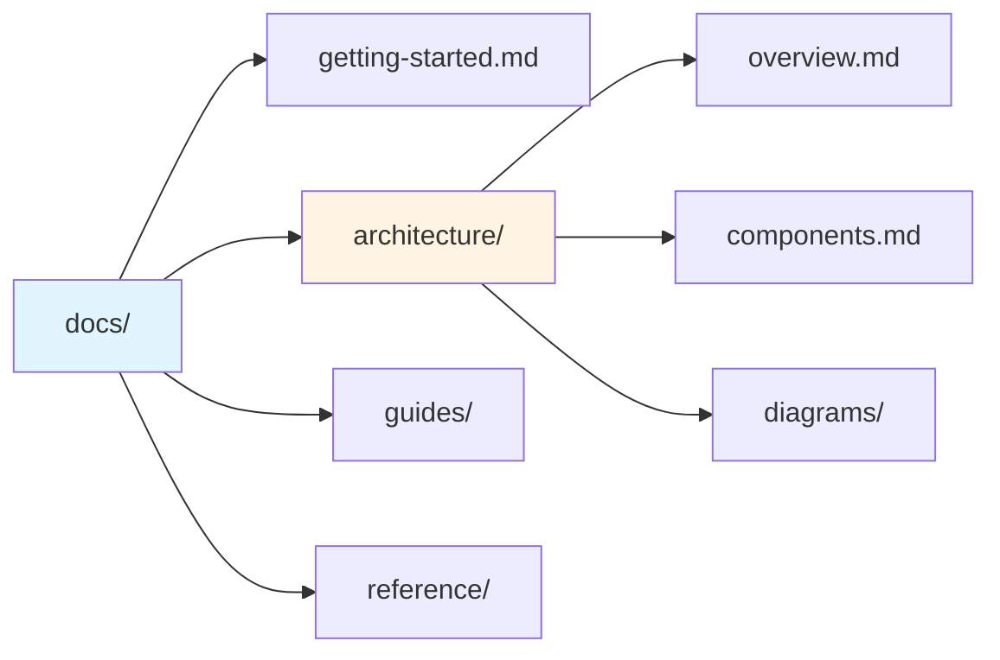
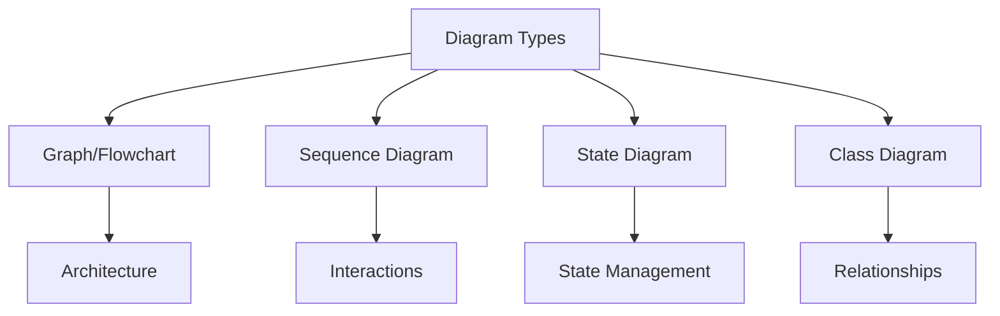

# Components

Detailed description of each component in the AI Skills project.

## Skill Definitions

**Location**: `.claude/skills/`

Markdown files that define specialized behaviors for Claude Code.

### Structure

Each skill file contains:
- **Title**: Clear name of the skill
- **Context**: When to use this skill
- **Process**: Step-by-step execution guide
- **Guidelines**: Rules and constraints
- **Output**: Expected results

### Currently Available

#### docs-manager
**Location**: `.claude/skills/docs-manager/`

Maintains documentation in the `docs/` folder.

**Responsibilities**:
- Analyze code changes
- Update affected documentation
- Prevent duplication
- Create visualizations
- Maintain structure

**Key Features**:
- Enforces 200-line limit per document
- Creates Mermaid diagrams
- Uses code references (`file:line`)
- Follows structured organization

#### cbs-analyzer
**Location**: `.claude/skills/cbs-analyzer/`

Downloads and analyzes CBS (Dutch Statistics) Open Data datasets.

**Responsibilities**:
- Query specific dataset IDs
- Download and process CBS data
- Analyze trends in Dutch statistics
- Generate visualizations and reports

**Key Features**:
- Automatic dataset download
- Energy, population, and economic analysis
- Integration with CBS Open Data API
- Data visualization capabilities

#### k8s-metrics
**Location**: `.claude/skills/k8s-metrics/`

Generates comprehensive Kubernetes cluster health reports.

**Responsibilities**:
- Collect pod status and resource usage
- Identify failed containers
- Monitor node health
- Calculate cluster utilization

**Key Features**:
- CPU and memory metrics by namespace
- Pod status summaries
- Node capacity analysis
- Failed container detection

#### container-sandboxes
**Location**: `.claude/skills/container-sandboxes/`

Operates local container sandboxes for safe code execution.

**Responsibilities**:
- Create isolated execution environments
- Run code safely using Docker/Podman
- Test packages in isolation
- Execute commands in containers

**Key Features**:
- Docker and Podman support
- No API key required
- Local execution
- Complete isolation

## Documentation System

**Location**: `docs/`

Organized, concise documentation for the project.

### Organization

### Content Types

1. **Getting Started**: Quick introduction and setup
2. **Architecture**: System design and structure
3. **Guides**: Feature-specific how-tos
4. **Reference**: API docs and configuration

### Quality Standards

- Maximum 200 lines per file
- Bullet points preferred over long paragraphs
- Code references use `file:line` format
- Diagrams for complex concepts
- Cross-references instead of duplication

## Skill Catalog

**Location**: `SKILL.md` (project root)

Central registry of all available skills.

**Contents**:
- List of skills with descriptions
- Usage guidelines
- Skill creation instructions
- Best practices

**Purpose**:
- Quick reference for users
- Onboarding documentation
- Skill discovery

## Visual Documentation

**Location**: Throughout `docs/`, especially `docs/architecture/diagrams/`

Uses Mermaid for diagrams:

### Diagram Types

### Guidelines

- Keep diagrams simple
- Focus on key concepts
- Use consistent styling
- Add brief explanations
- Embed in relevant docs
