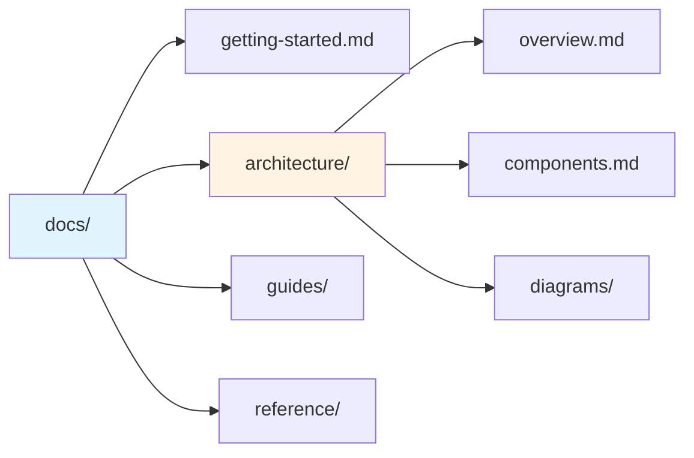
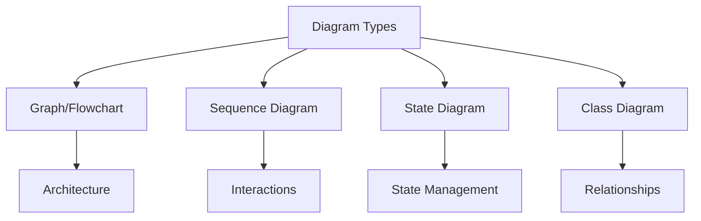

# Components

Detailed description of each component in the AI Skills project.

## Skill Definitions

**Location**: `.claude/skills/`

Markdown files that define specialized behaviors for Claude Code.

### Structure

Each skill file contains:
- **Title**: Clear name of the skill
- **Context**: When to use this skill
- **Process**: Step-by-step execution guide
- **Guidelines**: Rules and constraints
- **Output**: Expected results

### Currently Available

#### docs-manager
**File**: `.claude/skills/docs-manager.md`

Maintains documentation in the `docs/` folder.

**Responsibilities**:
- Analyze code changes
- Update affected documentation
- Prevent duplication
- Create visualizations
- Maintain structure

**Key Features**:
- Enforces 200-line limit per document
- Creates Mermaid diagrams
- Uses code references (`file:line`)
- Follows structured organization

#### honest-feedback
**File**: `.claude/skills/honest-feedback.md`

Provides direct, factual responses without sycophancy.

**Responsibilities**:
- Challenge bad ideas with technical reasoning
- Admit uncertainty when needed
- Point out flaws directly
- Ask clarifying questions
- Correct misconceptions

**Key Features**:
- No sugarcoating
- Factual accuracy prioritized
- Technical reasoning required
- Distinguishes facts from opinions

#### session-memory
**File**: `.claude/skills/session-memory.md`

Documents work completed in each session.

**Responsibilities**:
- Create session summaries
- Track file changes
- Record decisions
- Update memory index
- Tag for searchability

**Key Features**:
- <50 lines per session
- File references with line numbers
- Monthly folder organization
- memory-status.md index

## Documentation System

**Location**: `docs/`

Organized, concise documentation for the project.

### Organization

### Content Types

1. **Getting Started**: Quick introduction and setup
2. **Architecture**: System design and structure
3. **Guides**: Feature-specific how-tos
4. **Reference**: API docs and configuration

### Quality Standards

- Maximum 200 lines per file
- Bullet points preferred over long paragraphs
- Code references use `file:line` format
- Diagrams for complex concepts
- Cross-references instead of duplication

## Skill Catalog

**Location**: `SKILL.md` (project root)

Central registry of all available skills.

**Contents**:
- List of skills with descriptions
- Usage guidelines
- Skill creation instructions
- Best practices

**Purpose**:
- Quick reference for users
- Onboarding documentation
- Skill discovery

## Visual Documentation

**Location**: Throughout `docs/`, especially `docs/architecture/diagrams/`

Uses Mermaid for diagrams:

### Diagram Types

### Guidelines

- Keep diagrams simple
- Focus on key concepts
- Use consistent styling
- Add brief explanations
- Embed in relevant docs
