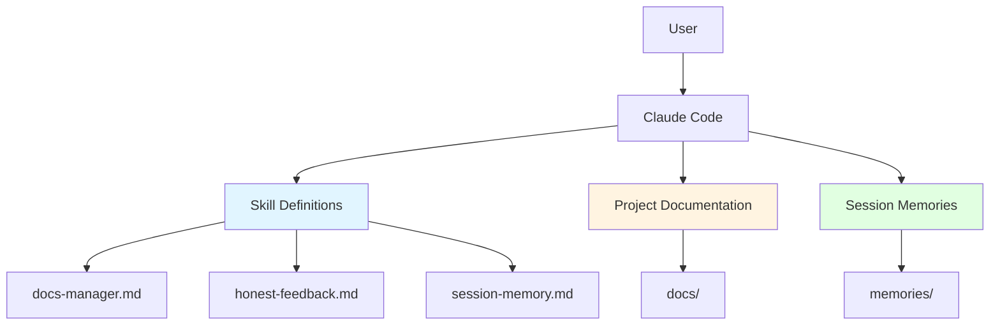
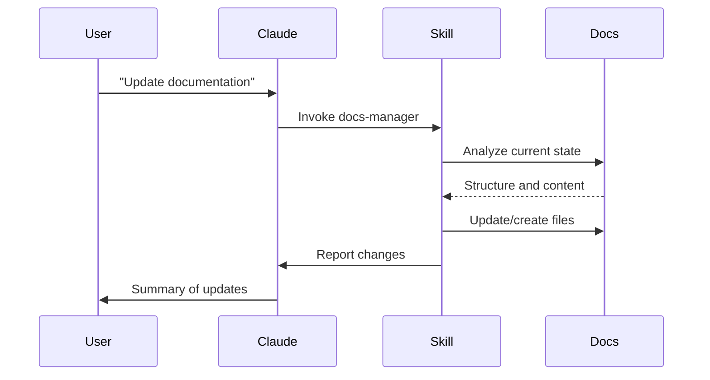

# Architecture Overview

This document describes the structure and design of the AI Skills project.

## System Design

The AI Skills project is a collection of reusable skill definitions for Claude Code. It follows a simple, file-based architecture.

## Components

### Skill Definitions (`.claude/skills/`)
- Markdown files containing skill prompts
- Each skill is self-contained
- Invoked by Claude Code using the Skill tool
- Location: `.claude/skills/[skill-name].md`
- Currently: docs-manager, honest-feedback, session-memory

### Documentation (`docs/`)
- Structured project documentation
- Maintained by skills (especially docs-manager)
- Organized by purpose: getting-started, architecture, guides, reference

### Session Memories (`memories/`)
- Work logs from each session
- Individual files in `memories/sessions/YYYY-MM/`
- Central index at `memories/memory-status.md`
- Tagged for searchability

### Skill Catalog (`SKILL.md`)
- Central registry of available skills
- Usage instructions and guidelines
- Kept in project root for easy access

## Data Flow

## Design Principles

1. **File-based**: Skills and docs are simple markdown files
2. **Self-contained**: Each skill is independent
3. **Reusable**: Skills work across different projects
4. **Maintainable**: Clear structure, no duplication
5. **Accessible**: Plain markdown, no complex tooling

## Extension Points

New skills can be added by:
1. Creating `.claude/skills/[new-skill].md`
2. Adding entry to `SKILL.md`
3. Following the skill structure template

See [SKILL.md](../../SKILL.md) for details.
